# "Визуализация томограмм"

Выполнил: студент группы 381808-1

**Оганян Роберт Владимирович**

Преподаватель: профессор кафедры  математического обеспечения и  суперкомпьютерных технологий Турлапов Вадим Евгеньевич

 

 

## Описание работы программы

Данная лабораторная работа выполнена в среде разработки VisualStudio с использованием библиотеки Open ToolKit. 

Open Toolkit является быстрой низкоуровневой оберткой для языка C# технологий OpenGL, OpenGL ES и OpenAL. Она работает на всех основных платформах и используется в приложениях, играх, научных исследованиях.

 Лабораторная работа посвящена визуализации томограмм. Определим основные требования:

1.  Считываемый файл должен быть в формате bin и представлять собой трехмерный массив

2.  Должны быть реализованы возможности изменения ширины и минимума в функции перевода значения плотностей томограммы в цвет

3. Должны быть реализованы 3 типа отрисовки томограммы:
   	1. Squads
       2. Texture
       3. SquadStrips

### Структура программы:

Bin – класс для загрузки томограммы из файла

View – класс для визуализации томограммы

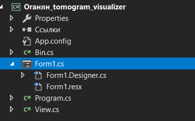

#### Главный экран

Главный экран представляет из себя окно, содержащее:

+ «Открыть» - загрузить .bin файл для последующей визуализации 

+ Шкала для перемотки слоев томограммы 
+ Шкала для изменения параметра min в функции перевода значения плотностей томограммы в цвет
+ Шкала для изменения параметра width в функции перевода значения плотностей томограммы в цвет
+ Выбор режима отрисовки для визуализации томограммы

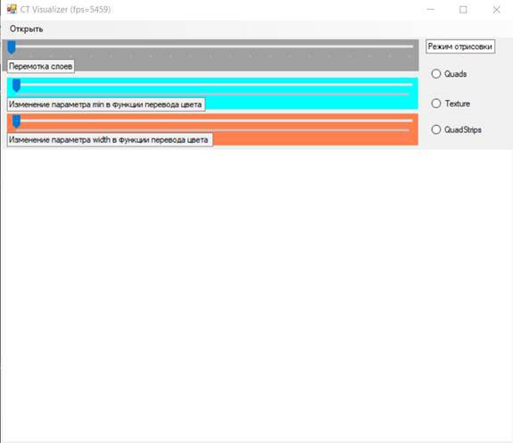

 

Итак, попробуем загрузить томограмму.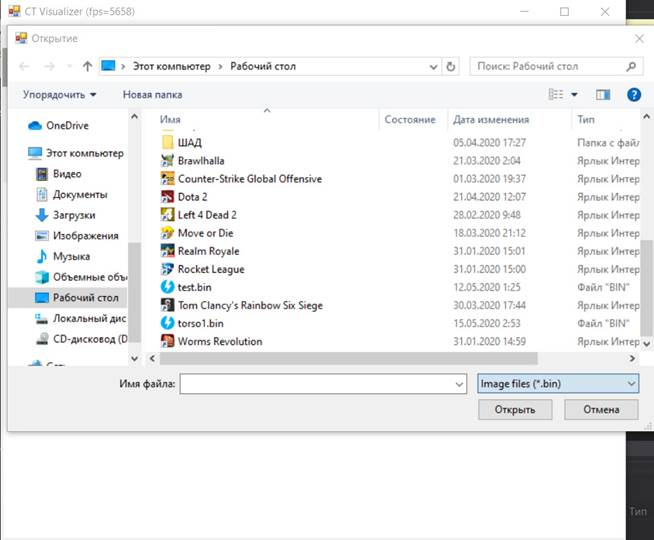

Для удобства нам сразу отображаются файлы нужного формата. Попробуем же загрузить файл неверного формата:

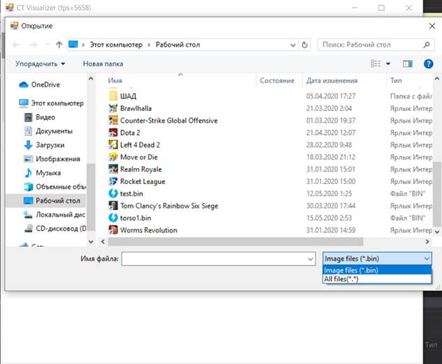

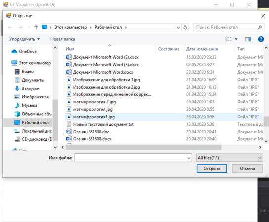

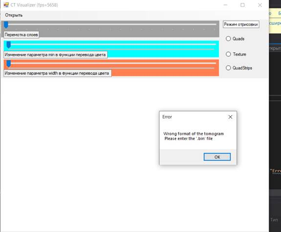

В таком случае выдается ошибка. Введем теперь файл верного формата:

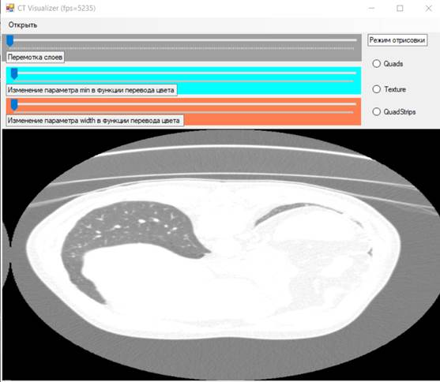

По умолчанию, ползунок на шкале min = 0, а по шкале width = 2000. Выглядит слишком засвеченным, попробуем покрутить ползунки.

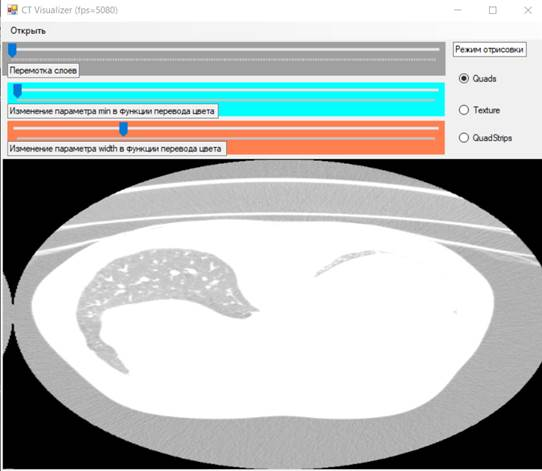

 

Стало еще хуже. Покрутим ползунки еще.

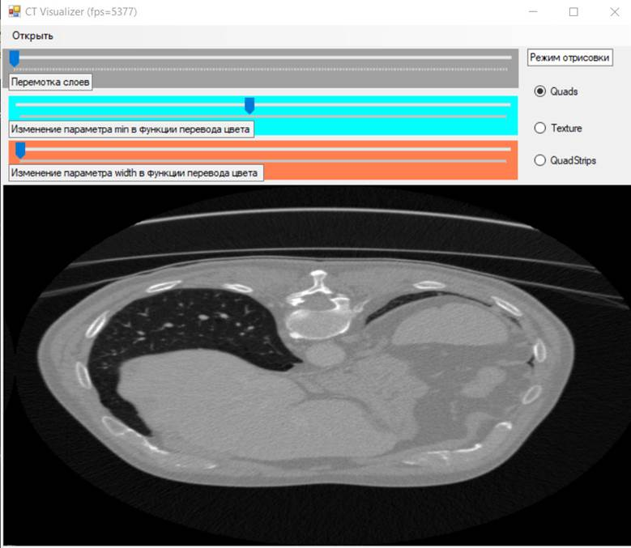

Так лучше. Теперь поговорим о способах визуализации.

#### Способы визуализации

1. Отрисовка четырехугольниками (**Quads**), вершинами которых являются центры вокселов текущего слоя регулярной воксельной сетки. Цвет формируется на центральном процессоре и отрисовывается с помощью функции GL.Begin(BeginMode.Quads).
2. Отрисовка текстурой (**Texture**). Текущий слой томограммы визуализируется как один большой четырехугольник, на который изображение слоя накладывается как текстура аппаратной билинейной интерполяцией.
3. Отрисовка четырехугольниками с общей гранью (**QuadStrips**), когда первый четырехугольник рисуется 4 вершинами, а последующие - 2 вершинами, присоединенными к предыдущему четырехугольнику (рис. ниже). Таким образом для отрисовки N четырехугольников требуется не 4*N вершин, а 2*N+2 вершин, что положительно сказывается на скорости работы программы. 

В данной реализации за 1 итерацию происходит 2 прохода. В первом проходе рисуется 2 ряда синих треугольников, во втором – 2 ряда красных, и мы получаем 2 полноценные полоски (слоя) томограммы. 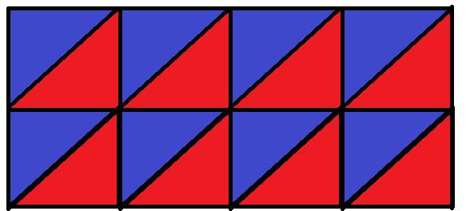

 

Полистаем слои томограммы: 

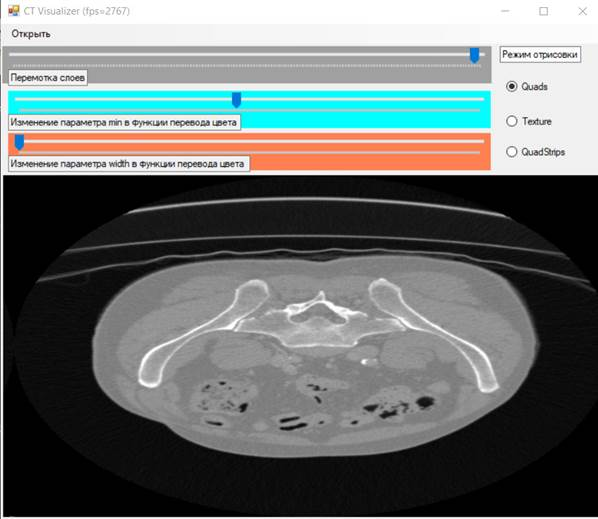

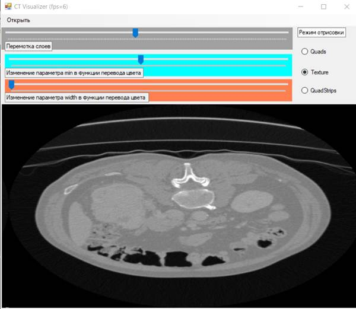

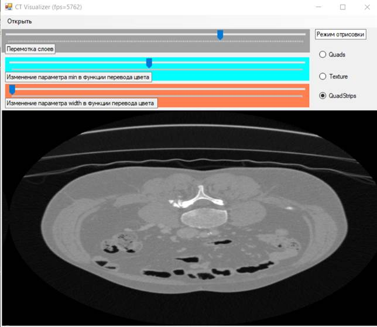

Было отмечено, что самым быстрым способом визуализации является третий способ – отрисовка с помощью четырехугольников с общей гранью. Это обуславливается эффективным использованием памяти ( для отрисовки N четырёхугольников требуется не 4N вершин, а 2N+2). 

## Заключение

Программа удовлетворяет следующим требованиям:

1. Существует проверка на правильность ввода данных.
2. Реализованы возможности изменения ширины и минимума в функции перевода значения плотностей томограммы в цвет
3. Реализованы 3 типа отрисовки томограммы:
    1. Squads
       2. Texture
       3. SquadStrips 

В ходе лабораторной работы был получен опыт работы с библиотекой Open Toolkit. 

## Приложение

Ссылка на исходный код: [https://github.com/OganyanRV/Csharp-Second_Year/tree/master/%D0%92%D0%B8%D0%B7%D1%83%D0%B0%D0%BB%D0%B8%D0%B7%D0%B0%D1%86%D0%B8%D1%8F%20%D1%82%D0%BE%D0%BC%D0%BE%D0%B3%D1%80%D0%B0%D0%BC%D0%BC%D1%8B](Визуализация томограммы)