# "Трассировка лучей"

 

Выполнил: студент группы 381808-1 

**Оганян Роберт Владимирович **

Преподаватель: профессор кафедры математического обеспечения и суперкомпьютерных технологий Турлапов Вадим Евгеньевич

 ## Описание работы программы

Данная лабораторная работа выполнена в среде разработки VisualStudio с использованием библиотеки Open ToolKit. 

Open Toolkit является быстрой низкоуровневой оберткой для языка C# технологий OpenGL, OpenGL ES и OpenAL. Она работает на всех основных платформах и используется в приложениях, играх, научных исследованиях. 

Ray Tracing - это алгоритм построения изображения трёхмерных моделей в компьютерных программах, при которых отслеживается обратная траектория распространения луча (от экрана к источнику).

Определим требования к лабораторной работе:

1. Реализация Ray Tracing.

2. В качестве дополнительного задания реализация интерфейса для изменения данных.
3. В качестве дополнительного задания реализовать куб и тетраэдр и посмотреть результаты при изменении глубины трассировки

 

## Структура программы:

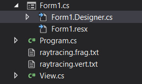

 

View – класс для загрузки и визуализации шейдеров.

Raytracing.vert.txt - Вершинный шейдер. Выполняет вспомогательные расчёты для фрагментного шейдера.

Raytracing.frag.txt – Фрагментный шейдер, делающий практически всю работу.

 

### Основные элементы программы:

​      ####  Файл Raytracing.frag.txt:

struct SCamera – структура камеры.

struct SRay – структура луча.

struct SSphere – структура Сферы.

struct STriangle – структура треугольников.

struct SIntersection – структура хранения пересечения.

struct SLight – структура источника света.

struct SMaterial – структура материалов.

struct STracingRay – структура, хранящая луч и номер переотражения, после которого луч внес вклад в результирующий цвет.

struct Stack – структура данных стек.

 

##### Типы отражения:

const int REFRACTION = 3;

const int DIFFUSE = 1;

const int MIRROR = 2;

​    SSphere spheres[2]; - Большая сфера спереди и маленькая сфера сзади

STriangle triangles[10]; - 2 треугольника вместе образуют прямоугольник. Пользуясь этим из 10 треугольников строим нашу сцену, содержащую 5 граней. 

SLight ulight; - источник света. Находится правее – выше сфер.

SMaterial materials[7] – Нам потребуется 7 материалов : 2 на сферы, 5 на грани, причем треугольникам одной и той же грани соответствует один материал.

 #### Основные функции

Все функции можно обобщить следующим образом:

1. Initialize и Generate функции инициализируют переменные данными по умолчанию

2. Intersect функции реализовывают пересечения луча с объектами сцены – треугольниками и сферами.

3. Shadow и Phong рисуют падающие тени. 

4. Raytrace пересекает луч со всеми примитивами сцены и возвращает ближайшее пересечение.

**Принцип работы функции main() **: Выпускаем первый луч и каждое его отражение помещаем в стек. Отражения мы обрабатываем в структуре switch case, где есть 3 варианта:

DIFFUSE; - Диффузное отражение.

MIRROR – Зеркальное отражение;

REFRACTION – Отражение от прозрачной среды;

Если луч пересекается с диффузным объектом, то вычисляется цвет объекта, а если с зеркальным, то создается новый зеркальный луч, который снова трассируется в сцену.

#### Файл view.cs:

glCreateShader - создаёт объект шейдера, её аргумент определяет тип шейдера, возвращает значение, которое можно использовать для ссылки на объект шейдера.

InitShaders - Создает объекты шейдеров, скомпилировать их и скомпоновать в объекте шейдерной программы.

DrawBufferObjects – заполняет окно визуализации.

InitScreen – рисует объекты на экране.

А также много Set-функций, которые понадобились для реализации дополнительного задания.

 

### Результат выполнения основной части работы:

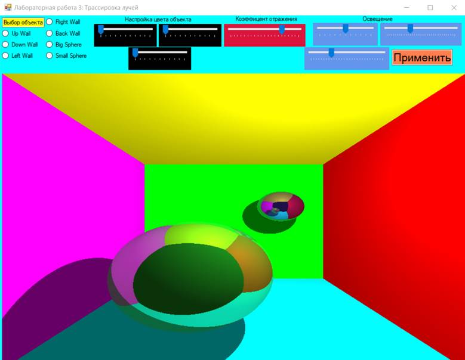

Полученный результат соответствует требованиям.

**В качестве расширяющего задания была реализована передача параметров объектов (цвет, прозрачность, зеркальная составляющая) в шейдер при помощи глобальных переменных и изменение их без перекомпиляции программы.**

 

На панели сверху мы, для начала, можем выбрать, какой объект мы хотим изменить. Исходя из реализации основной части работы, у нас есть 7 объектов. Выберем для начала UpWall и поменяем ее цвет используя три шкалы под табличкой «изменение цвета». Затем нажимаем на кнопку «Применить».

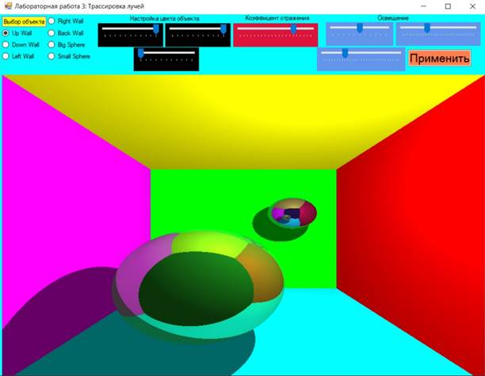

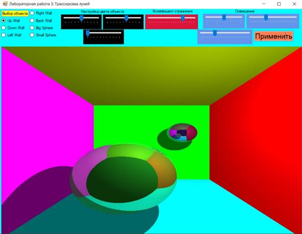

Аналогично для остальных стенок:

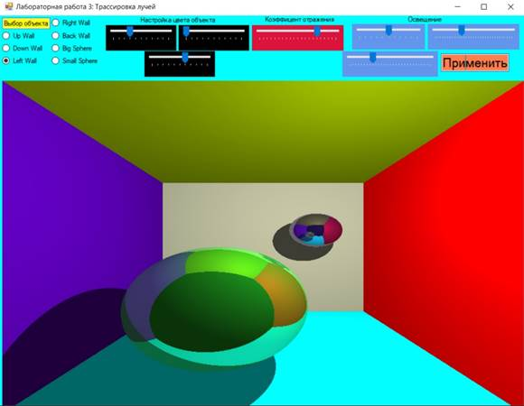

 

Заметим, что при этом отраженные цвета на сферах меняются, что доказывает корректность работы программы.

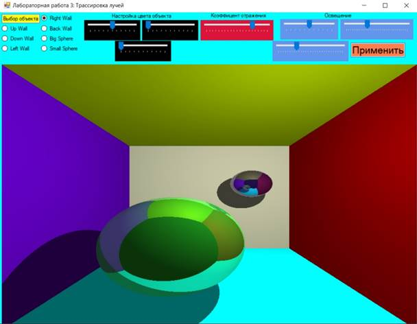

Поменяем цвета сфер так, чтобы большая сфера была белой, а маленькая – черной.

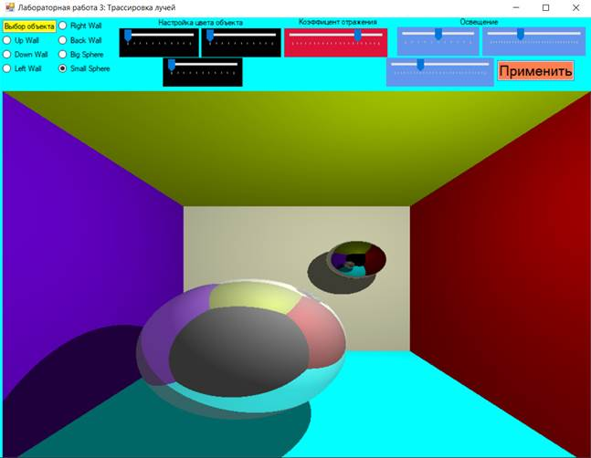

Возможно не очевидно, что цвет большей сферы белый. Чтобы в этом убедиться, попробуем поменять коэффициенты отражения: 

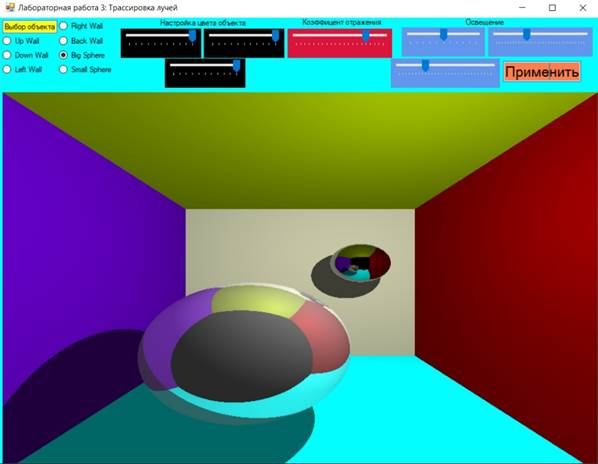

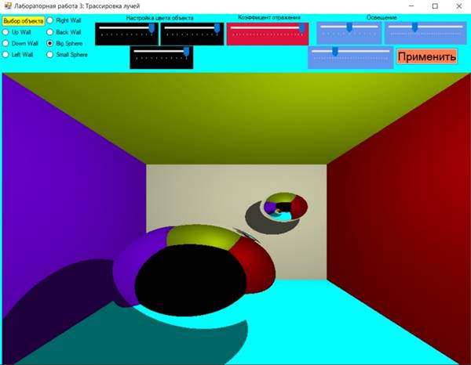

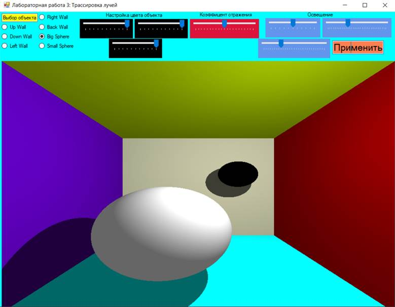

 

Убедились. Теперь попробуем покрутить ползунки в настройке освещения:

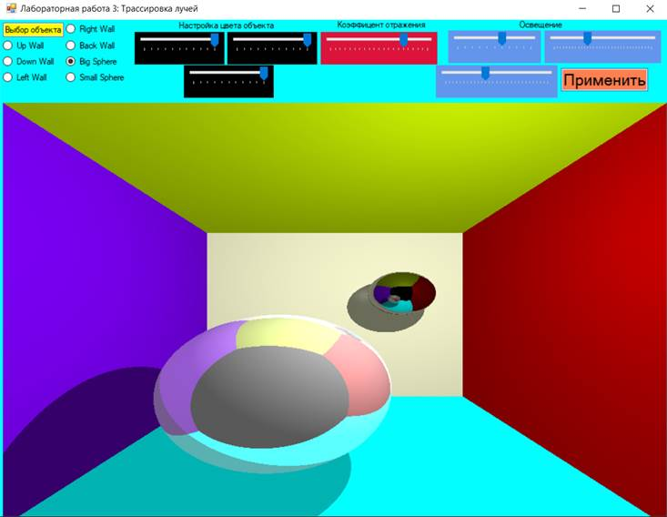

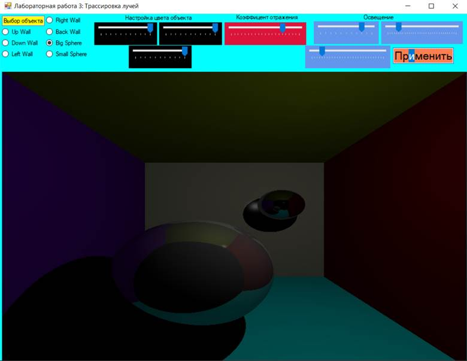

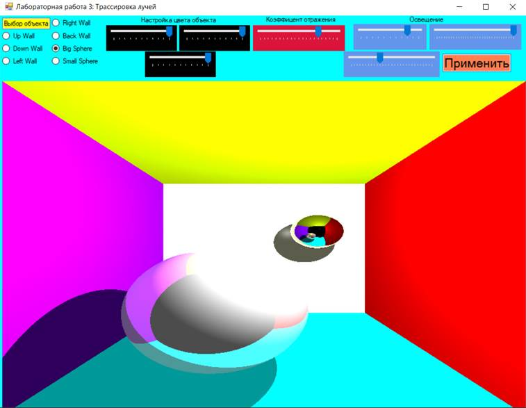

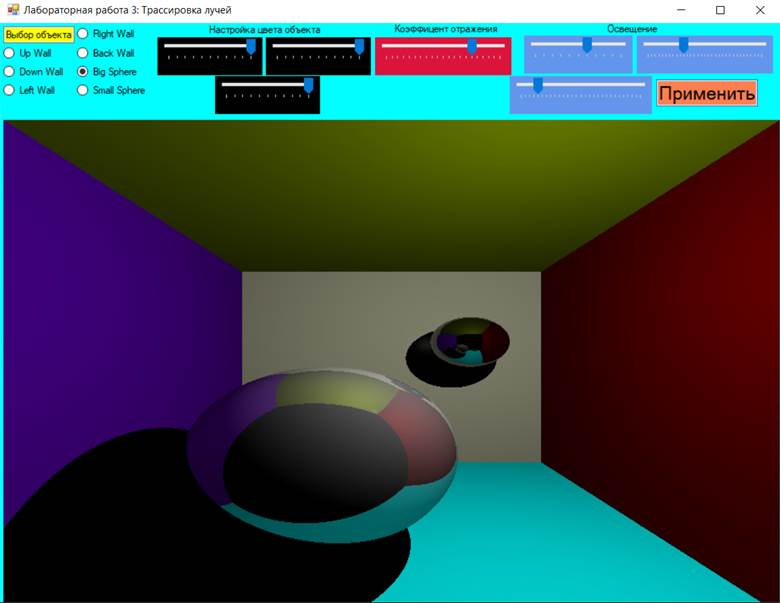 

Попробуем реализовать также куб и тетраэдр.

Тетраэдр сам по себе состоит из 4 треугольников, так что воспользуемся массивом треугольников на 4 элемента.

Куб же состоит из 6 граней, каждая из которых может быть описана 2 треугольниками. Так что для построения куба нам потребуется 12 треугольников.

Также, меняя глубину трассировки (максимальное количество отражений) посмотрим на результат (и для интереса сделаем верхнюю стену зеркальной):

При глубине трассировки 1:

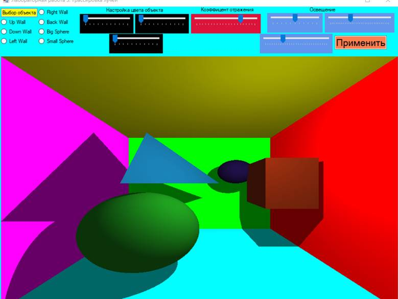

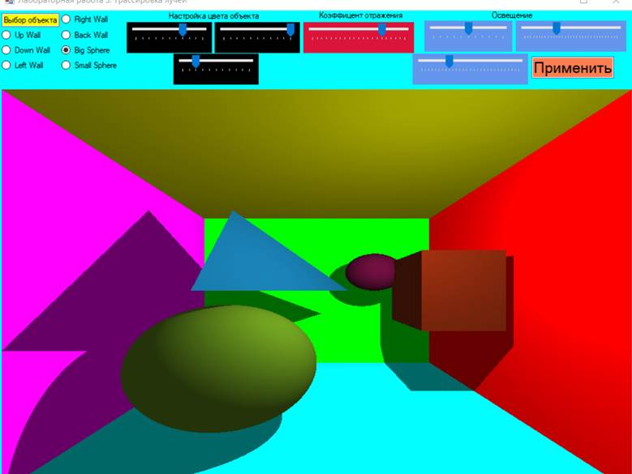

Объекты имеют монотонный цвет, которым они окрашены с помощью material[i]

Увеличим глубину трассировки: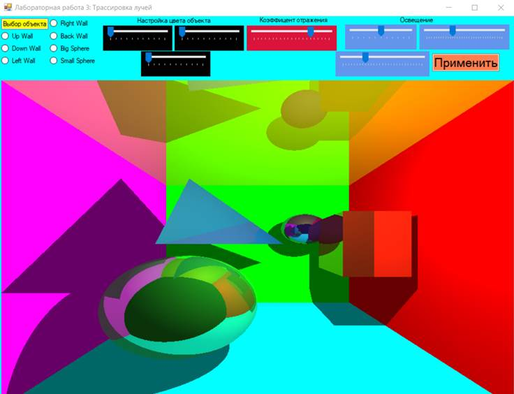

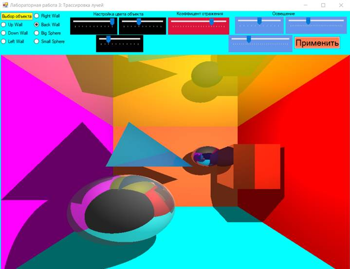

 

Увеличим глубину трассировки еще:

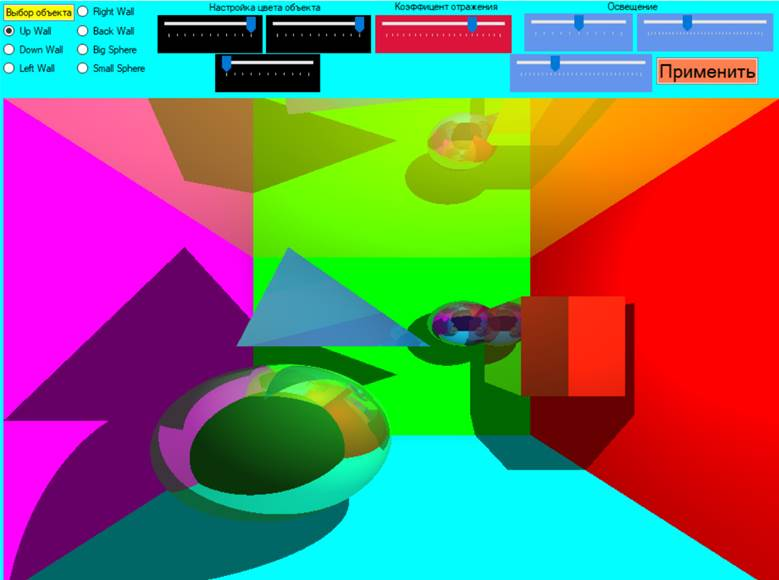

Как видим, чем больше глубина трассировки, тем больше обработано лучей, соответственно картинка получается более детальной

## Заключение

Программа удовлетворяет следующим требованиям:

1. Реализована основная часть работы, связанная с трассировкой лучей.

2. В качестве расширяющего задания была реализована передача параметров объектов (цвет, прозрачность, зеркальная составляющая) в шейдер при помощи глобальных переменных и изменение их без перекомпиляции программы.

3. В качестве других расширяющих заданий были реализованы куб, тетраэдр и исследование зависимости результата от изменения глубины трассировки

 

В ходе лабораторной работы был получен опыт работы с библиотекой Open Toolkit и опыт написания кода в txt без подсказок ☹ .

 ## Приложение

Ссылка на код: https://github.com/OganyanRV/Csharp-Second_Year